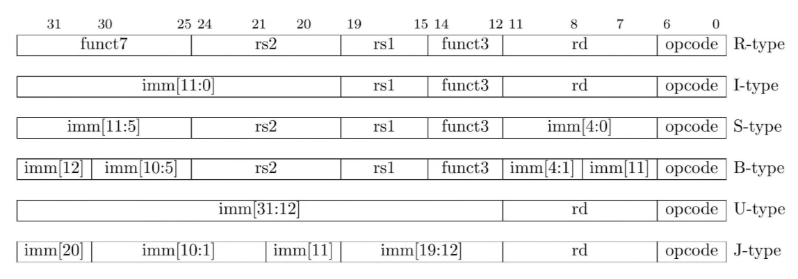
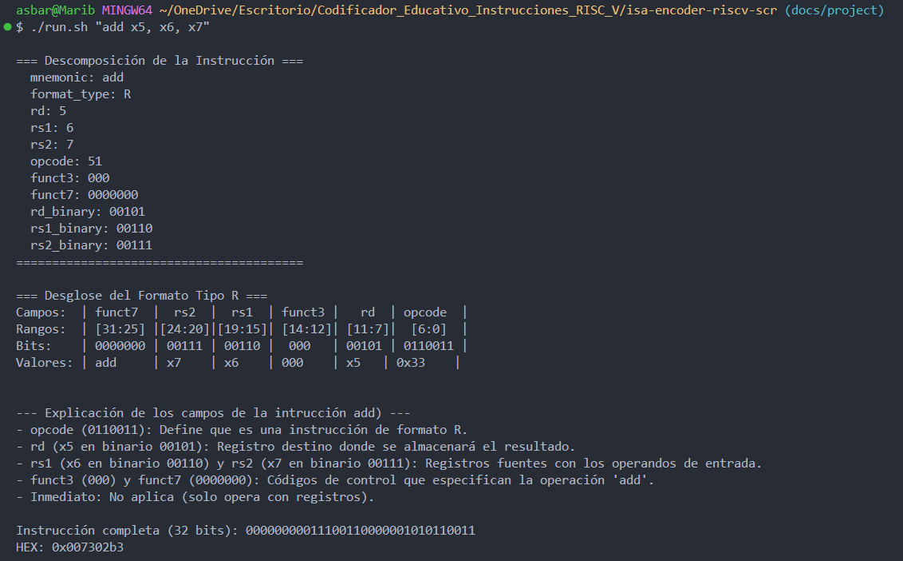
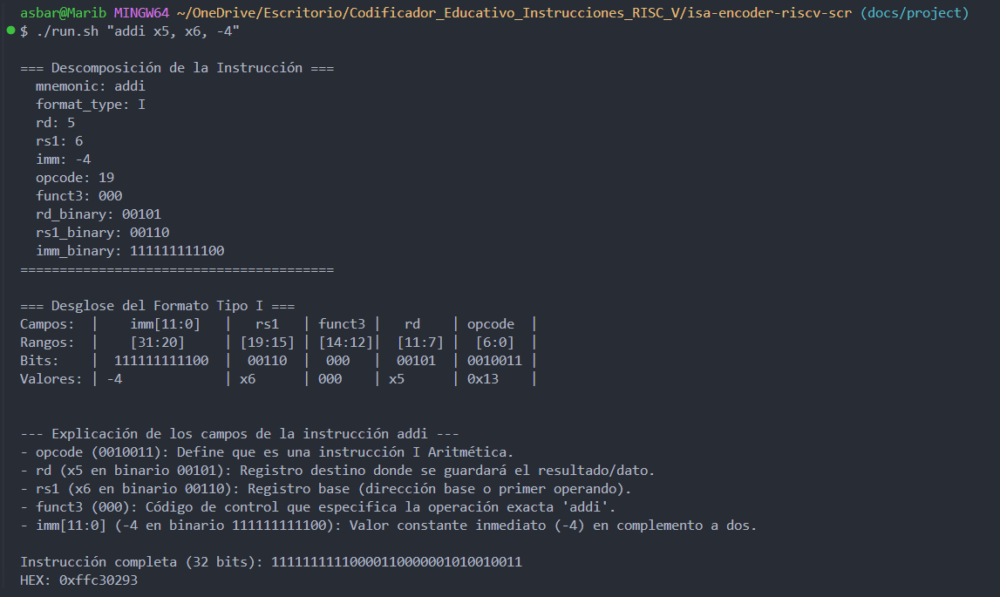
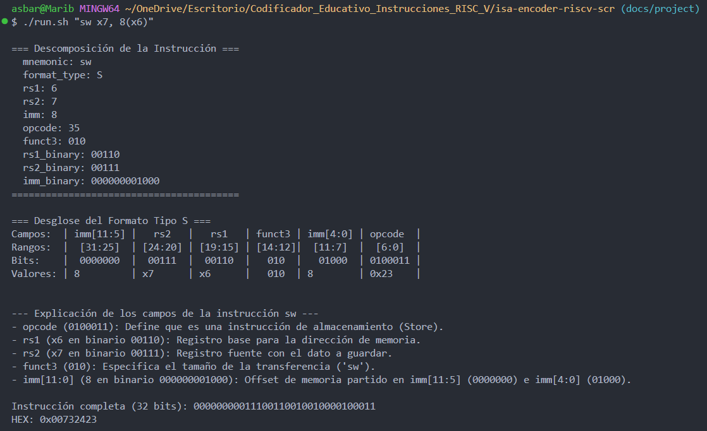
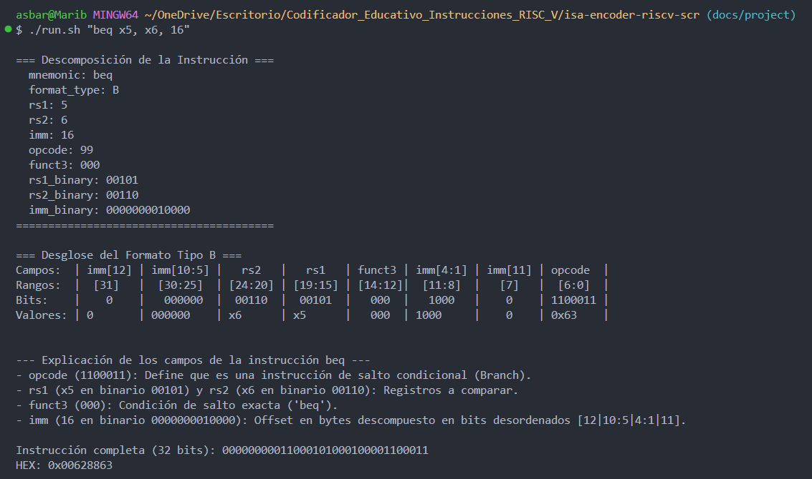
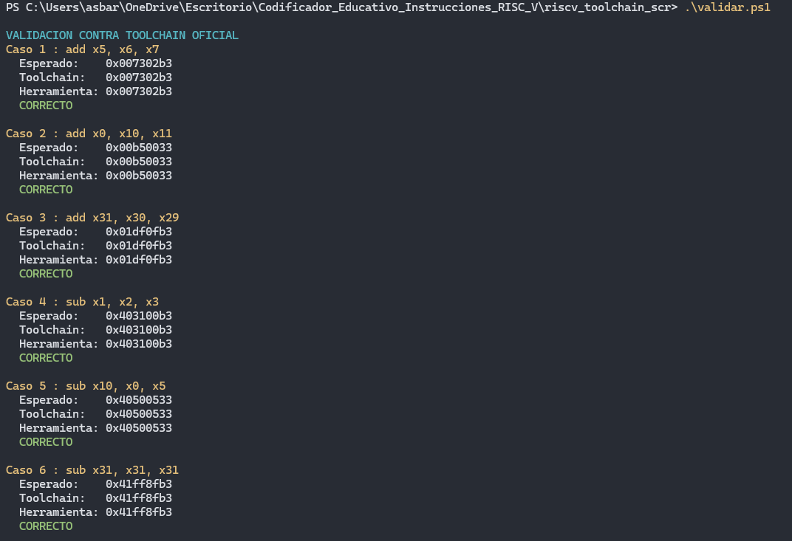
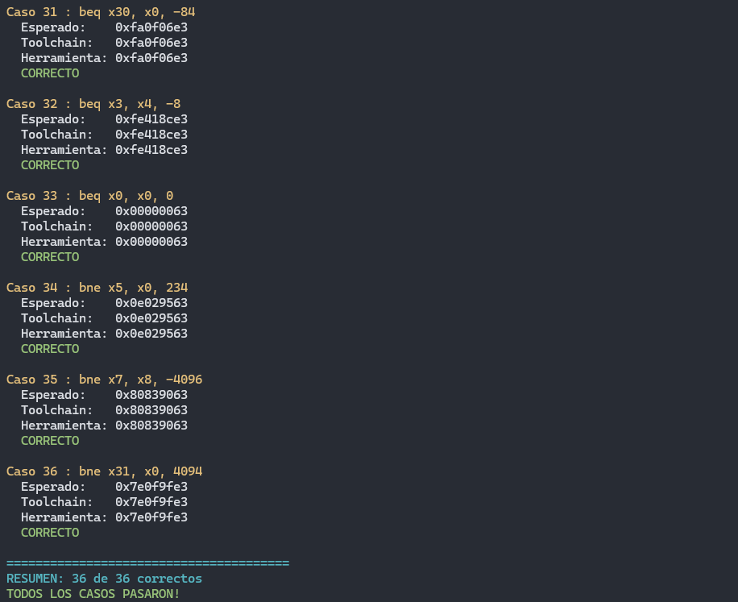

# Codificador Educativo de Instrucciones RISC-V

# 1. Descripción del proyecto

**Codificador_Educativo_Instrucciones_RISC_V** es una herramienta desarrollada en Python cuyo objetivo es mostrar de manera educativa cómo una instrucción escrita en lenguaje ensamblador RISC-V se transforma en una instrucción máquina de **32 bits**.

El programa recibe una instrucción desde la terminal mediante el script `run.sh`:

```bash
./run.sh "<instruccion>"
```

Por ejemplo:

```bash
./run.sh "add x5, x6, x7"
```

El script ejecuta el archivo principal:

```text
encode_skeleton.py
```

El programa analiza la instrucción recibida, determina a qué formato pertenece, identifica sus operandos y convierte los registros e inmediatos correspondientes a representación binaria. Posteriormente, los diferentes campos de la instrucción son colocados en las posiciones correspondientes dentro de una palabra de **32 bits**, de acuerdo con la codificación establecida para la arquitectura RISC-V.

Como resultado, el programa muestra:

* La descomposición de la instrucción ingresada.
* El formato RISC-V identificado.
* Los campos que forman la instrucción.
* Los rangos de bits ocupados por cada campo.
* La representación binaria de registros e inmediatos.
* La instrucción completa de 32 bits.
* Su representación hexadecimal en el formato:

```text
0xFFFFFFFF
```

---

# 2. Objetivo

El objetivo principal de la herramienta es facilitar la comprensión del proceso de **codificación de instrucciones RISC-V**, permitiendo observar cómo una instrucción en ensamblador se divide en diferentes campos y cómo estos campos se organizan hasta producir la representación binaria ejecutada por el procesador.

A diferencia de una herramienta que únicamente presenta el valor hexadecimal final, este codificador muestra también la estructura interna de la instrucción, permitiendo identificar elementos como:

* `opcode`
* `rd`
* `rs1`
* `rs2`
* `funct3`
* `funct7`
* inmediatos

---

# 3. Referencia utilizada para la codificación

La distribución de los campos, los `opcode`, los valores de `funct3`, `funct7` y la organización de los formatos de instrucción fueron tomados de la especificación de la arquitectura RISC-V:

> **The RISC-V Instruction Set Manual, Volume I: User-Level ISA, Document Version 20191213.**
> [Consultar manual](https://archive.org/details/the-risc-v-instruction-set-manual-volume-i-user-level-isa-document-version-20191213/mode/2up)

Esta especificación se utilizó como referencia para construir correctamente las instrucciones de 32 bits correspondientes a los formatos **R, I, S y B** implementados en el proyecto, para determinar la posición de los campos `opcode, rd, rs1, rs2, funct3, funct7, imm` así como la división y reorganización de los bits del inmediato utilizada en los formatos S y B.


>Codificación de las intrucciones RISC-V. Tomado de The RISC-V Instruction Set Manual, Volume I: User-Level ISA, Document Version 20191213.

---

# 4. Instrucciones soportadas

Actualmente, el codificador soporta instrucciones pertenecientes a cuatro formatos de RISC-V: **R, I, S y B**.

| Formato | Instrucciones soportadas   |
| ------- | -------------------------- |
| **R**   | `add`, `sub`, `and`, `or`  |
| **I**   | `addi`, `andi`, `lb`, `lw` |
| **S**   | `sw`, `sb`                 |
| **B**   | `beq`, `bne`               |

En total, la herramienta permite codificar **12 instrucciones**.

### 4.1 Formato R

Las instrucciones de formato R realizan operaciones utilizando registros.

Sintaxis general:

```text
instruccion rd, rs1, rs2
```

Instrucciones soportadas:

```text
add
sub
and
or
```

Ejemplo:

```bash
./run.sh "add x5, x6, x7"
```

---

### 4.2 Formato I

El formato I es utilizado tanto para operaciones aritméticas con valores inmediatos como para instrucciones de carga desde memoria.

#### Operaciones aritméticas

Sintaxis:

```text
instruccion rd, rs1, inmediato
```

Instrucciones soportadas:

```text
addi
andi
```

Ejemplo:

```bash
./run.sh "addi x5, x6, -4"
```

#### Operaciones de carga

Sintaxis:

```text
instruccion rd, inmediato(rs1)
```

Instrucciones soportadas:

```text
lb
lw
```

Ejemplo:

```bash
./run.sh "lw x5, 8(x6)"
```

---

### 4.3 Formato S

Las instrucciones de formato S permiten almacenar en memoria el contenido de un registro.

Sintaxis:

```text
instruccion rs2, inmediato(rs1)
```

Instrucciones soportadas:

```text
sw
sb
```

Ejemplo:

```bash
./run.sh "sw x7, 8(x6)"
```

---

### 4.4 Formato B

Las instrucciones de formato B corresponden a saltos condicionales.

Sintaxis:

```text
instruccion rs1, rs2, inmediato
```

Instrucciones soportadas:

```text
beq
bne
```

Ejemplo:

```bash
./run.sh "beq x5, x6, 16"
```

---

# 5. Funcionamiento general del codificador

El funcionamiento del programa puede dividirse en las siguientes etapas:

```text
Instrucción ingresada
        |
        v
Análisis de la sintaxis
        |
        v
Identificación del mnemónico
        |
        v
Determinación del formato R / I / S / B
        |
        v
Extracción de registros e inmediatos
        |
        v
Conversión a representación binaria
        |
        v
Asignación de opcode, funct3 y funct7
        |
        v
Construcción de la instrucción de 32 bits
        |
        v
Conversión a hexadecimal
```

## 5.1 Análisis de la instrucción

Inicialmente, el programa elimina las comas y espacios innecesarios de la entrada y separa cada componente de la instrucción.

Por ejemplo:

```text
add x5, x6, x7
```

se interpreta como:

```text
add
x5
x6
x7
```

El primer elemento corresponde al **mnemónico**, el cual permite determinar qué operación se desea realizar.

A partir de este mnemónico, el programa determina también el formato correspondiente.

Por ejemplo:

```text
add  -> R
addi -> I
sw   -> S
beq  -> B
```

---

## 5.2 Conversión de registros

Los registros de RISC-V utilizados por el programa se encuentran entre:

```text
x0 - x31
```

Cada registro puede representarse utilizando **5 bits**. Por ejemplo:

```text
x5  = 00101
x6  = 00110
x7  = 00111
x10 = 01010
```

El programa primero extrae la parte numérica del registro (quitando el 'x') y posteriormente genera su representación binaria de cinco bits. Además, se verifica que el registro ingresado pertenezca al rango válido de `x0` a `x31`.

---

## 5.3 Conversión de inmediatos

Las instrucciones de los formatos I, S y B pueden contener valores inmediatos. El programa convierte estos valores a binario utilizando la cantidad de bits requerida por cada formato. Para representar valores negativos se utiliza **complemento a dos**.

Por ejemplo, un inmediato de:

```text
-4
```

representado utilizando 12 bits corresponde a:

```text
111111111100
```

Posteriormente, dependiendo del formato de la instrucción, estos bits pueden permanecer juntos o dividirse entre diferentes posiciones de la instrucción.

---

# 6. Construcción de los diferentes formatos

## 6.1 Formato R

La estructura de una instrucción RISC-V de tipo R es:

```text
| funct7 | rs2 | rs1 | funct3 | rd | opcode |
| 31:25  |24:20|19:15| 14:12  |11:7|  6:0   |
```

El codificador construye la palabra de 32 bits concatenando los campos en este mismo orden:

```text
funct7 + rs2 + rs1 + funct3 + rd + opcode
```

---

## 6.2 Formato I

La estructura del formato I es:

```text
| imm[11:0] | rs1 | funct3 | rd | opcode |
|   31:20   |19:15| 14:12  |11:7|  6:0   |
```

La construcción utilizada por el programa es:

```text
imm[11:0] + rs1 + funct3 + rd + opcode
```

Este formato es utilizado por el proyecto para dos tipos de operaciones:

* Operaciones aritméticas: `addi`, `andi`.
* Operaciones de carga: `lb`, `lw`.

La principal diferencia entre ambas se encuentra en el `opcode` y en el significado del inmediato. En una instrucción aritmética, el inmediato representa un valor utilizado directamente en la operación y en una instrucción de carga, el inmediato funciona como un **offset de memoria** con respecto a la dirección almacenada en `rs1`.

---

## 6.3 Formato S

El formato S posee la siguiente distribución:

```text
| imm[11:5] | rs2 | rs1 | funct3 | imm[4:0] | opcode |
|   31:25   |24:20|19:15| 14:12  |   11:7   |  6:0   |
```

A diferencia del formato I, el inmediato de 12 bits se divide en dos secciones:

```text
imm[11:5]
imm[4:0]
```

El programa construye la instrucción utilizando:

```text
imm[11:5] + rs2 + rs1 + funct3 + imm[4:0] + opcode
```

El registro `rs1` contiene la dirección base de memoria, mientras que `rs2` contiene el dato que será almacenado.

---

## 6.4 Formato B

El formato B posee una distribución particular del inmediato:

```text
| imm[12] | imm[10:5] | rs2 | rs1 | funct3 | imm[4:1] | imm[11] | opcode |
|   31    |   30:25   |24:20|19:15| 14:12  |   11:8   |    7    |  6:0   |
```

El inmediato utilizado para el salto se representa utilizando 13 bits y posteriormente se divide en:

```text
imm[12]
imm[10:5]
imm[4:1]
imm[11]
```

Finalmente, el programa forma la instrucción mediante:

```text
imm[12] + imm[10:5] + rs2 + rs1 + funct3 + imm[4:1] + imm[11] + opcode
```
---

# 7. Ejemplos de ejecución

A continuación se presentan cuatro ejemplos representativos del funcionamiento del programa, utilizando una instrucción de cada formato implementado.

---

## 7.1 Ejemplo de formato R — `add`

### Instrucción

```bash
./run.sh "add x5, x6, x7"
```

La operación representa:

```text
x5 = x6 + x7
```

Los registros utilizados son:

```text
rd  = x5 = 00101
rs1 = x6 = 00110
rs2 = x7 = 00111
```

Para `add`:

```text
funct7 = 0000000
funct3 = 000
opcode = 0110011
```

Por lo tanto, los campos quedan organizados como:

```text
0000000 | 00111 | 00110 | 000 | 00101 | 0110011
```

La instrucción completa es:

```text
00000000011100110000001010110011
```

Representación hexadecimal:

```text
0x007302b3
```

### Evidencia de ejecución

> **Captura de la ejecución de `add x5, x6, x7`.**



---

## 7.2 Ejemplo de formato I — `addi`

### Instrucción

```bash
./run.sh "addi x5, x6, -4"
```

La operación representa:

```text
x5 = x6 + (-4)
```

Los registros son:

```text
rd  = x5 = 00101
rs1 = x6 = 00110
```

El inmediato `-4`, representado en complemento a dos utilizando 12 bits, es:

```text
111111111100
```

La distribución de campos es:

```text
111111111100 | 00110 | 000 | 00101 | 0010011
```

La instrucción completa obtenida es:

```text
11111111110000110000001010010011
```

Representación hexadecimal:

```text
0xffc30293
```

### Evidencia de ejecución

> **Captura de la ejecución de `addi x5, x6, -4`.**



---

## 7.3 Ejemplo de formato S — `sw`

### Instrucción

```bash
./run.sh "sw x7, 8(x6)"
```

Esta instrucción almacena el contenido de `x7` en memoria utilizando como dirección base el registro `x6` y un desplazamiento de 8 bytes.

```text
rs1 = x6
rs2 = x7
imm = 8
```

Para la instrucción `sw`:

```text
funct3 = 010
opcode = 0100011
```

El inmediato debe dividirse entre:

```text
imm[11:5]
imm[4:0]
```

Los campos resultantes producen la instrucción:

```text
00000000011100110010010000100011
```

Representación hexadecimal:

```text
0x00732423
```

### Evidencia de ejecución

> **Captura de la ejecución de `sw x7, 8(x6)`.**



---

## 7.4 Ejemplo de formato B — `beq`

### Instrucción

```bash
./run.sh "beq x5, x6, 16"
```

La instrucción compara los registros:

```text
x5
x6
```

Si ambos contienen el mismo valor, se realiza el salto correspondiente al desplazamiento indicado.

```text
rs1 = x5
rs2 = x6
imm = 16
```

Para `beq`:

```text
funct3 = 000
opcode = 1100011
```

Debido al formato B, los bits del inmediato deben ser reorganizados antes de construir la instrucción.

El resultado generado por el codificador es:

```text
00000000011000101000100001100011
```

Representación hexadecimal:

```text
0x00628863
```

### Evidencia de ejecución

> **Captura de la ejecución de `beq x5, x6, 16`.**



---

# 8. Validación de los resultados

Para comprobar que las codificaciones producidas por la herramienta desarrollada son correctas, el repositorio incluye un script de validación utilizando el toolchain **xPack GNU RISC-V Embedded GCC**.

El proceso compara la representación hexadecimal generada por el codificador educativo contra la codificación obtenida utilizando las herramientas del toolchain RISC-V.

Los casos utilizados para las pruebas se encuentran almacenados en:

```text
riscv_toolchain_scr/casos_prueba.txt
```

La validación puede ejecutarse desde PowerShell mediante:

```powershell
Set-ExecutionPolicy -Scope Process -ExecutionPolicy Bypass
.\riscv_toolchain_scr\validar.ps1
```

El script procesa los casos de prueba y permite comprobar si el valor hexadecimal producido por el programa desarrollado coincide con el valor generado mediante el toolchain de referencia. Para que se pueda ejecutar `validar.ps1`, asegúrese que `riscv_toolchain_scr/Tools/` contenga `xpack/xpack-riscv-none-elf-gcc-15.2.0-1/`. Lea el README.md para ver con más detalle los pasos.

---

## 8.1 Evidencia de comparación

Para la validación de las instrucciones implementadas se creó el script `validar.ps1`, el cual ejecuta 36 instrucciones RISC-V establecidas en el archivo `casos_prueba.txt` el cual utiliza casos límites, valores negativos y positivos. Las 36 instrucciones validadas son: 

```text
# --- add ---
add x5, x6, x7;0x007302b3
add x0, x10, x11;0x00b50033
add x31, x30, x29;0x01df0fb3
# --- sub ---
sub x1, x2, x3;0x403100b3
sub x10, x0, x5;0x40500533
sub x31, x31, x31;0x41ff8fb3
# --- and ---
and x12, x13, x14;0x00e6f633
and x1, x0, x2;0x002070b3
and x30, x31, x1;0x001fff33
# --- or ---
or x8, x9, x10;0x00a4e433
or x15, x15, x0;0x0007e7b3
or x31, x1, x30;0x01e0efb3
# --- addi ---
addi x5, x6, 100;0x06430293
addi x7, x8, -50;0xfce40393
addi x9, x0, 2047;0x7ff00493
# --- andi ---
andi x1, x2, 15;0x00f17093
andi x0, x5, 0;0x0002f013
andi x3, x4, -2048;0x80027193
# --- lw ---
lw x31, 8(x11);0x0085af83
lw x12, -16(x13);0xff06a603
lw x0, 0(x0);0x00002003
# --- lb ---
lb x0, 4(x2);0x00410003
lb x3, -2048(x4);0x80020183
lb x31, 2047(x31);0x7fff8f83
# --- sw ---
sw x1, 12(x6);0x00132623
sw x7, -32(x8);0xfe742023
sw x0, 0(x10);0x00052023
# --- sb ---
sb x1, 0(x2);0x00110023
sb x3, -2048(x0);0x80300023
sb x31, 2047(x30);0x7fff0fa3
# --- beq ---
beq x30, x0, -84;0xfa0f06e3
beq x3, x4, -8;0xfe418ce3
beq x0, x0, 0;0x00000063
# --- bne ---
bne x5, x0, 234;0x0e029563
bne x7, x8, -4096;0x80839063
bne x31, x0, 4094;0x7e0f9fe3
```

El script `validar.ps1` está realizado con verificación automática, por lo que al ejecutarse, muestra en consola el resultado hexadecimal esperado, el producido por el toolchain y el de la herramienta creada. A continuación se adjuntan imágenes de algunas partes salida de dicho script. En la segunda imagen se puede ver que los 36 casos fueron exitosos. 




---

# 9. Manejo de entradas inválidas

El codificador incluye validaciones para evitar procesar instrucciones que no pertenecen al subconjunto implementado.Entre las comprobaciones se encuentran:

* Verificación de que el mnemónico esté soportado.
* Verificación de la cantidad correcta de operandos.
* Validación del formato de los registros.
* Validación de que los registros se encuentren entre `x0` y `x31`.
* Validación de la sintaxis `inmediato(rs1)` utilizada por instrucciones de memoria.
* Conversión de inmediatos negativos mediante complemento a dos.

---

# 10. Conclusión

El **Codificador Educativo de Instrucciones RISC-V** permite observar de forma detallada el proceso mediante el cual una instrucción escrita en ensamblador es transformada a su representación máquina y hexadecimal. La implementación de instrucciones de formatos R, I, S y B permite observar diferencias importantes entre ellos, principalmente en el uso de registros, códigos de operación e inmediatos.

Finalmente, la comparación de los resultados contra el toolchain RISC-V utilizado como referencia permite comprobar que las palabras de 32 bits producidas por el programa corresponden con las codificaciones esperadas.
